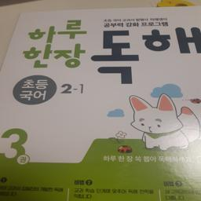
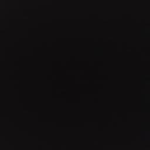
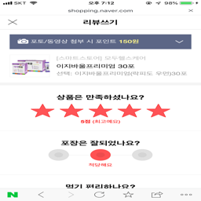
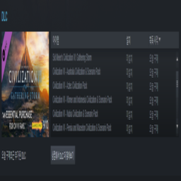

# Spam classification

Repo for training a baseline model for the AI Rush Spam classification challenge. The model is just a simple ResNet50v2
model. We first fine-tune the last layer a few epochs and then train the full model until convergence. Note that the
dataset has unlabeled data, but to train the baseline model we only use the labeled data. 

## Important notes
1. The function that's bind to NSML infer needs to output a dataframe with the two columns `filename` and `y_pred`,
where `filename` is the name of the file that's being predicted and `y_pred` is an integer value of the predicted class.

## Repository format
`spam/spam_classifier/networks` contains the neural network definitions.

`spam/spam_classifier/models` contains your full model code, this handles things like training, evaluation, 
instantiation of datasets and neural networks, chaining of different neural networks etc.

`spam/spam_classifier/datasets` contains logic related to loading data.

`spam/training/experiments` contains all of your experiment configs, setting things like which model and dataset to use,
to parameters related to models and networks.

`spam/training/train.py` glues everything together with NSML. Loads the experiment config and starts the training.

`nsml_train.py` This file is just used do make sure that the project runs properly on NSML. It should always be the
entrypoint when running `nsml run` but you can ignore it otherwise.

## Run experiment

To run the baseline model training, stand in the `airush2020/spam` folder and run 
```
nsml run -e nsml_train.py -d spam-1 -m "A good message" -g 1 -a "--experiment_name v1"
```

## Metric
Using a geometric mean over all spam classes.
```
score = (f1_score_monotone * f1_score_screenshot * f1_score_unknown) ** (1 / 3)
```

## Data
### Description
There are four different classes; normal, monotone, screenshot, and unknown. The latter three are spam classes. 
The mapping between class names and the integer values used in the labels file is 
`normal: 0, monotone: 1, screenshot: 2, unknown: 3, unlabeled: -1`.
#### Normal
Normal review images, that should not be detected as spam.


#### Monotone
Images that are not real review images, and mostly containing one color.


#### Screenshot 
Images that are not real review images, and contain screenshots from the Naver shopping website.


#### Unknown
Images that are not real review images, but don't fall under any of the classes above.


#### Unlabeled
Images that have not been labeled yet. Can be used to train the model in a semi-supervised way if you want.

### Format
See AI Rush dataset documentation.


